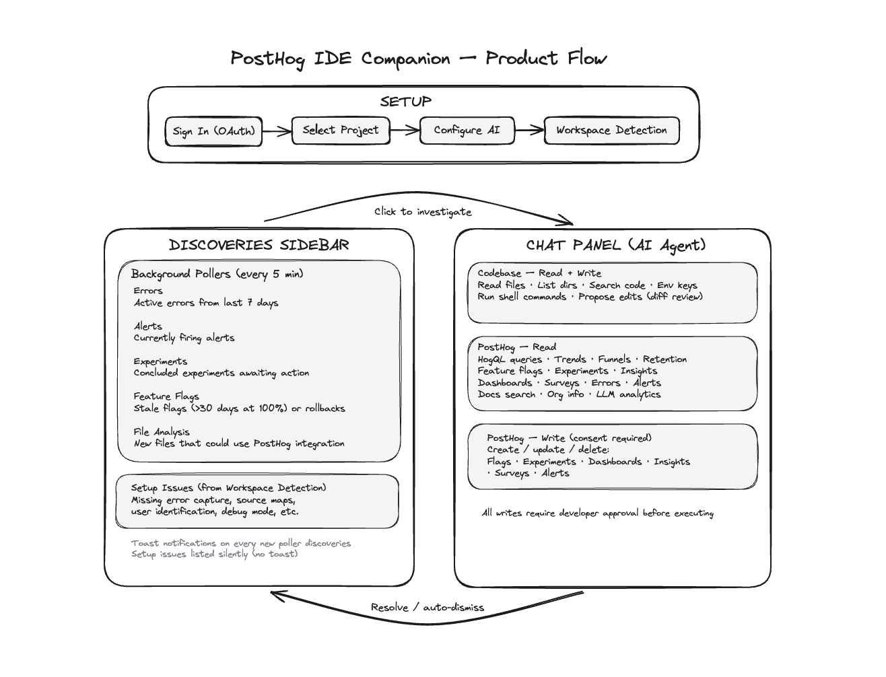

# PostHog IDE Companion

My initial motivation and journey were a little interesting...
- Found PostHog on Twitter, signed up to use on my project and discover the onboarding [Wizard](https://github.com/PostHog/wizard).
- Immediately jumped on it, but hit a 401 bug. Decided it's faster to debug than to raise an issue
- Dug in and figured it was an issue with PostHog's internal LLM gateway
- Unblocked myself by adding a flag to introduce BYOK to bypass the gateway by choice, and that became my [first PR](https://github.com/PostHog/wizard/pull/271)
- That works, but there is another problem discovered: 60% of events captured, in my case, were not needed.
- Instead of leaving me with dead code to clean up, why not ask for my approval and make the process interactive?
- Added that as well, and that brought about my [Second PR](https://github.com/PostHog/wizard/pull/275)

At this point, someone from the team had reached out, said some appreciative words, and even hooked me up with a discount on the merch store (thanks for that). We exchanged a few emails.

But I just couldn't stop there, I thought this could go beyond onboarding, could establish more PostHog stickiness if used daily. 

Wizard and MCPs already exist, but there's still a gap. Developers have to go to the browser or, at best, ask their MCP-integrated AI about what's happening in PostHog. That's a **pull**. How about we flip to a **push**, a proactive discovery layer right in the IDE where product builders already spend their day. Not in Slack, not in email. Those get buried mostly.

That led to **PostHog Companion**

A VSCode/VSCode-fork compatible extension that shows you what's happening with your product in real-time and does everything PostHog AI can do, without leaving your editor.

## What it does

Basically, two things.

First, it watches your PostHog project in the background and tells you when stuff needs attention. Errors popping up, alerts firing, experiments that concluded, feature flags that have been sitting at 100% for way too long. You don't have to go looking for any of it.

Second, PostHog AI chat fully built in. You can query your data, spin up dashboards, create and manage alerts, toggle feature flags, set up surveys, investigate errors, search your codebase, and get code fix suggestions. All without leaving your editor.



### 1. Integration

Similar to the Wizard, but with the familiar visual diffs and interactions right in VS Code. The Companion analyzes your codebase, figures out the right SDK and config, and shows you exactly what it wants to do. You approve before anything changes.

https://github.com/user-attachments/assets/2bc4daa6-e2d1-4210-9922-bfb3f8c648ee

### 2. Custom event tracking

The wizard does this during onboarding as a one-shot pass. PostHog Companion makes it ongoing. It can scan your codebase for places where captures make sense, but you approve and can tweak every single one. You can also just highlight a function and say: "add captures here." When you create new files, it watches for those too and suggests captures if they make sense.

https://github.com/user-attachments/assets/029405a8-1f64-4894-8838-b7dd5fa2bff6

### 3. Errors

Active errors from PostHog show up in your Discoveries Sidebar. Click one of them, the AI pulls the stack trace, searches your codebase for the relevant code, and proposes a fix. All in one conversation, no tab switching.

https://github.com/user-attachments/assets/ad655fc6-ad33-4ea0-b6f3-9961f56afcc2

### 4. Alerts

Create, update, and manage PostHog alerts without leaving VS Code. When one fires, you get notified, investigate the cause, and fix it in the same flow.

https://github.com/user-attachments/assets/93adc9dc-9473-4abc-8636-c4804f5a3e88


### 5. Feature flags

Create flags, spot stale ones that have been sitting at 100% rollout for over 30 days, and catch rollbacks you might've missed. You can highlight some code and ask the companion to wrap it in a flag, and it'll do that and even help you toggle it on and off from the chat.

https://github.com/user-attachments/assets/6752c6c1-991b-4ebf-93ca-4ad55c22ac37

### 6. Dashboards

Ask something like "how many users signed up this week?" and the AI queries PostHog, builds insights on the fly, and can put together a full dashboard for multiple insights you can share with your team.

https://github.com/user-attachments/assets/ce199c05-7abf-4a42-af49-28f52496aa62

### 7. Surveys

Describe the survey you want in plain English, and the AI sets it up in PostHog. Need it tied to a specific button or user action? It creates the survey on PostHog's side and proposes the code changes to wire it up in your codebase.

https://github.com/user-attachments/assets/eed48843-3080-4c5d-b49b-d5bcc6911543

<br>

## Key technical decisions

**Single-loop agent, not a multi-agent graph.** The AI runs one iterative loop with access to a bunch of tools (internal ones, MCP, and REST). It keeps full conversation context, self-corrects, and decides what to do next. No routing between specialized sub-agents that lose context at every handoff.

**MCP for live PostHog data.** I actually started by building custom tools against PostHog's REST API because my initial OAuth scopes only gave me access to like 8 MCP tools. After expanding the scopes, I realized the MCP server covers most of what I needed. So I swapped out my custom tools for MCP equivalents and only kept the ones MCP doesn't provide yet, like alert management. Less code to maintain, and the tools stay current as PostHog updates its server.

**Tool tiering with consent and dynamic injection.** Not all tools are created equal. Reading a file is safe. Editing your code or deleting an alert? Not so much. So tools are organized into tiers, and anything that mutates your codebase or PostHog data requires explicit approval. There's also a practical reason for this: loading every single tool into the prompt at once was causing hallucinations from lost-in-the-middle context. So I split them into core tools (always loaded) and dynamic ones (the LLM just knows their names and requests the full definition when it actually needs one). Keeps things focused.

**Proactive polling.** Five pollers running on 5-minute intervals, each watching for something different: active errors, firing alerts, concluded experiments, stale feature flags, and flag rollbacks. Results show up in the Discoveries Sidebar with badge counts. The architecture is designed so adding new discovery type is just dropping in another poller.

**OAuth with PKCE and Dynamic Client Registration.** PostHog supports DCR and PKCE, which meant I could build the auth flow without needing a hardcoded client ID. The extension registers itself as a client each session via DCR, generates PKCE challenges with S256, and spins up a localhost callback on whatever port the OS gives it. Works across PostHog's US and EU cloud regions without any pre-configuration needed.

**Agentic workspace detection.** Instead of depending on PostHog's hosted LLM proxy or the [context-mill](https://github.com/PostHog/context-mill) pipeline, I took a fully agentic approach. It explores the codebase on its own. It reports back structured JSON with frameworks, project structure, and any PostHog setup issues, with actual file paths as evidence. This means it adapts to whatever project you throw at it.

**Context compaction.** When conversations get long, older messages get summarized while the last 4 exchanges stay intact. There's a fun edge case where the summarizer LLM sometimes tries to call tools during compaction, so there's a fallback that just extracts user messages instead. Prevents infinite recursion and keeps conversations going without blowing up context limits.


## Path to production

Everything above works end-to-end today with BYOK for Anthropic or OpenAI. Here's what would make it fully production-ready:

**PostHog LLM gateway integration.** This is the big one. Right now, users need their own API keys. Hooking into PostHog's native LLM gateway means zero extra (or baked-in) cost for users. PostHog handles the AI infra as with the Wizard, BYOK becomes optional.

**PostHog Analytics.** Need to wire in analytics service so we know what is going on while being used. Heck, maybe it can even wire this in by itself.

**Cross-framework testing.** Built and tested against JavaScript/TypeScript projects so far. Needs proper validation across Python, Ruby, Go, and the other frameworks PostHog supports.

**Prompt eval pipeline.** The prompts work, but I haven't put them through any systematic evaluation yet. Building an eval pipeline with real-world scenarios to measure accuracy, hallucination rate, and task completion is required for production.

**More LLM providers.** Currently Anthropic and OpenAI. Adding more models means more people can use it.

**Verified OAuth client.** The DCR flow works but isn't verified by PostHog yet. Getting it verified means a smoother auth experience without security warnings.

**Polish.** Better icons, marketplace listing copy, a proper first-run experience. The stuff that makes it feel like a real product and not a side project.

**Docs.** Setup guides, configuration options, what commands are available. Clear enough that someone can get going without reading source code.

**E2E QA.** Testing across VS Code versions, different OSes, and all the edge cases. Network failures, huge workspaces, rate limits, etc.


## Getting started

### You'll need

- VS Code 1.85+
- A [PostHog](https://posthog.com) account
- An API key from [Anthropic](https://console.anthropic.com) or [OpenAI](https://platform.openai.com). **Anthropic Preferable**

### Setup

```bash
git clone https://github.com/okedeji/posthog-ide-companion.git
cd ph-companion
pnpm install
pnpm compile
```

Then hit `fn + F5` in VS Code to launch the extension in a dev host. Sign in to PostHog from the sidebar, pick your project, configure your AI provider, and you're good.

The extension starts polling your project right away and surfaces discoveries as they come in.


## Stack

- TypeScript (strict mode)
- Anthropic SDK + OpenAI SDK
- MCP SDK
- Zod for runtime schema validation
- esbuild for bundling
- Jest for testing
- VS Code Extension API for sidebar views, webview panels, auth provider, and code lenses.
